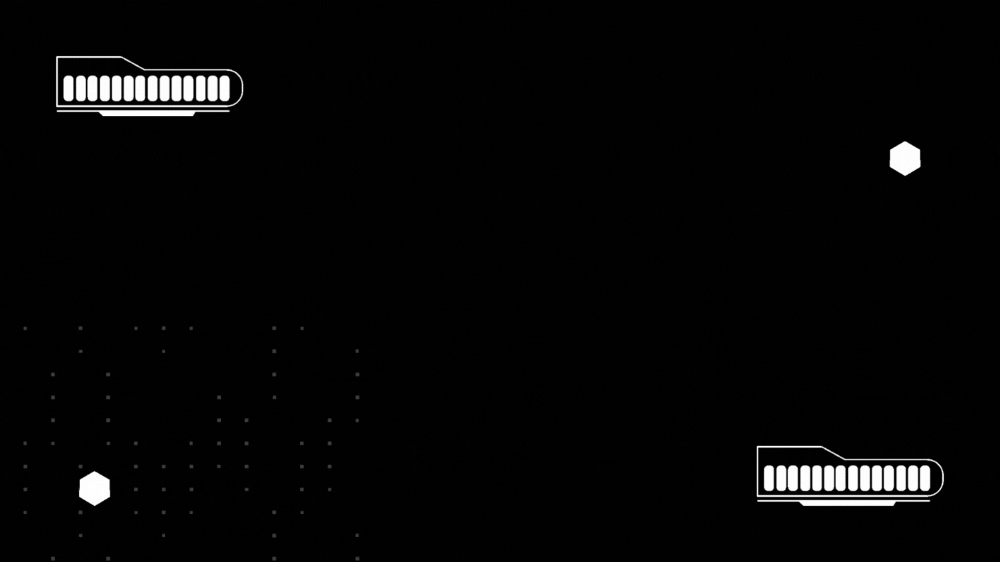
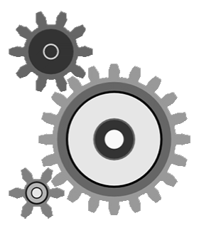

<h1 align="center">Hi Geeks, I'm Anupesh </h1>

  <a href="https://anupesh-portfolio.netlify.app/" style="font-size: 24px; color: red; text-decoration: none;">My Portfolio</a>

        
 
<h2>  About Me</h2>

<ul>
        <li>
🎓 <b>Bachelor in Technology </b> in <b>Electronic and Communication Enginnering</b> from <b>NIT Allahabad (MNNIT)</b>, 2024 Graduate
</li>
        <li>
💼  <b>Software Developer | Full Stack Developer</b>
</li>
        <li>
🔭 Presently, working as <b>Python Developer Intern</b>
</li>
        <li>
💬 Talk to me about <b>DSA, Web development, Machine Learning, Hackathons, Tech news</b>
</li>
</ul>
<!-- <h2>  About Me</h2> -->
<!--  -->
<ul>
        <li>
🥇 <b>14th Global Rank in Hacksquad:</b> Contributed to open-source projects in a team event.
</li>
        <li>
🏆 <b>Platinum Winner in DevElevate:</b> Excelled in a blog writing competition by Showwcase.
</li>
</ul>
        
            
<h2> Programming Languages</h2>

            
            
            
<!--              -->

<h2> Web Development</h2>

            
            
            
             
            
            
            
            

<h2> Tools & Libraries</h2>

            
            
            
            

<!----------------------------------------------Editors-------------------------------------------------->
<h2> IDE/Editors</h2>

            
            
            

            
<!------------------------------------------Connect With Me --------------------------------------------->      
<h2> Connect With Me</h2>

            
            
            
            
            
            

<!-----------------------------------------------------------GitHub Analytic---------------------------------------------------->
<h2>  GitHub Analytics</h2>
<table>
    <td align="center">
        
    </td>
    <td align="center">
        
    </td>

</table>

    

 

<!------------------------------------------ Github Trophy ----------------------------------->
<h2>Github Trophies</h2>

 

<!------------------------------------------------------------------ Badges ------------------------------------------------------------>
<h2>Bagdes Earned</h2>

<table>
    <td align="center">
        
    </td>
</table>
