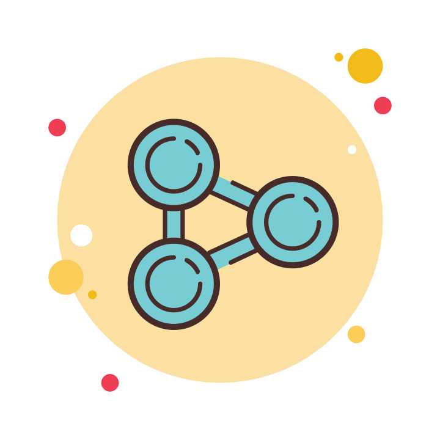

<!DOCTYPE html>
<html lang="en">

<h1 align="center">Hi,  I'm Anupesh</h1>
        
            
<h2>🛠 Tech Stack</h2>

            
            
            
            
             
<!--  -->
            
            
<!--  -->
            
            
            

            
<h2>💻 IDE/Editors</h2>

            
            
            

            
            
<h2> Connect With Me</h2>

            
            
            
            
            

  
